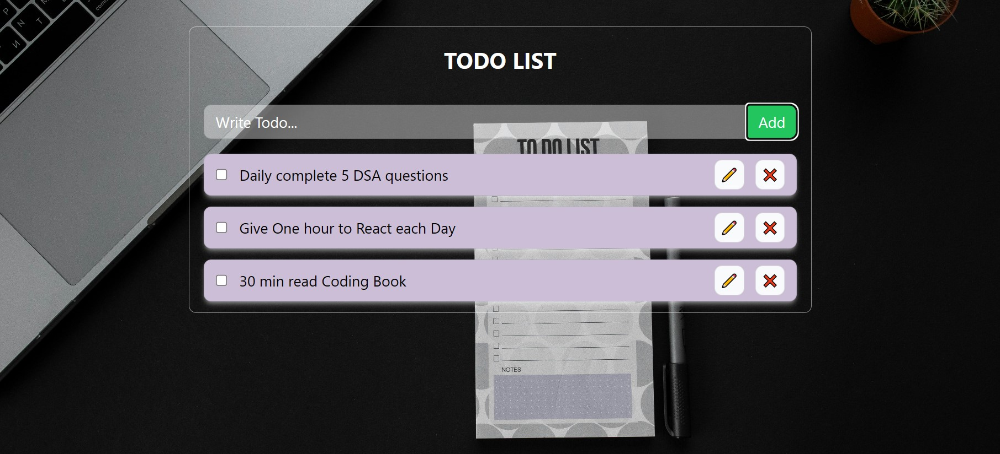

# Todo List App

This is a simple and user-friendly Todo List application that allows you to add, update, delete, check, and uncheck todos. The app uses `localStorage` to store data so that your todos are retained even after refreshing the page.

## Features

- **Add Todo:** Allows you to add new tasks to your todo list.
- **Update Todo:** You can update the details of your existing todos.
- **Delete Todo:** Easily remove tasks that you no longer need.
- **Check/Uncheck Todo:** Mark tasks as completed or revert them back to incomplete.
- **Persistent Storage:** Uses `localStorage` to save your todos, ensuring they are available even after refreshing the page.

## Screenshot



## Installation

1. Clone the repository:
    ```bash
    git clone <repository-url>
    ```
2. Navigate to the project directory:
    ```bash
    cd todo-list-app
    ```
3. The run the project:
    ```bash
    npm run dev
    ```
## Usage

1. Open `index.html` in your preferred web browser.
2. Start managing your tasks by adding new todos, updating existing ones, marking them as complete, or deleting them.

## Code Overview

- **index.html:** The main HTML file that includes the structure of the app.
- **styles.css:** Contains the styling for the app.
- **script.js:** The JavaScript file that handles the functionality of the app including adding, updating, deleting, checking, and unchecking todos. Also manages the interaction with `localStorage` to persist data.

## Local Development

To make changes to the app, simply open the project files in your favorite code editor. Any changes made to the JavaScript, JSX, or CSS files will be reflected when you reload the `index.html` file in your browser.

## Contributing

If you'd like to contribute to this project, please fork the repository and use a feature branch. Pull requests are warmly welcome.

## License

This project is licensed under the MIT License - see the LICENSE file for details.

---

© [Abid Johar](https://github.com/AbidJohar)